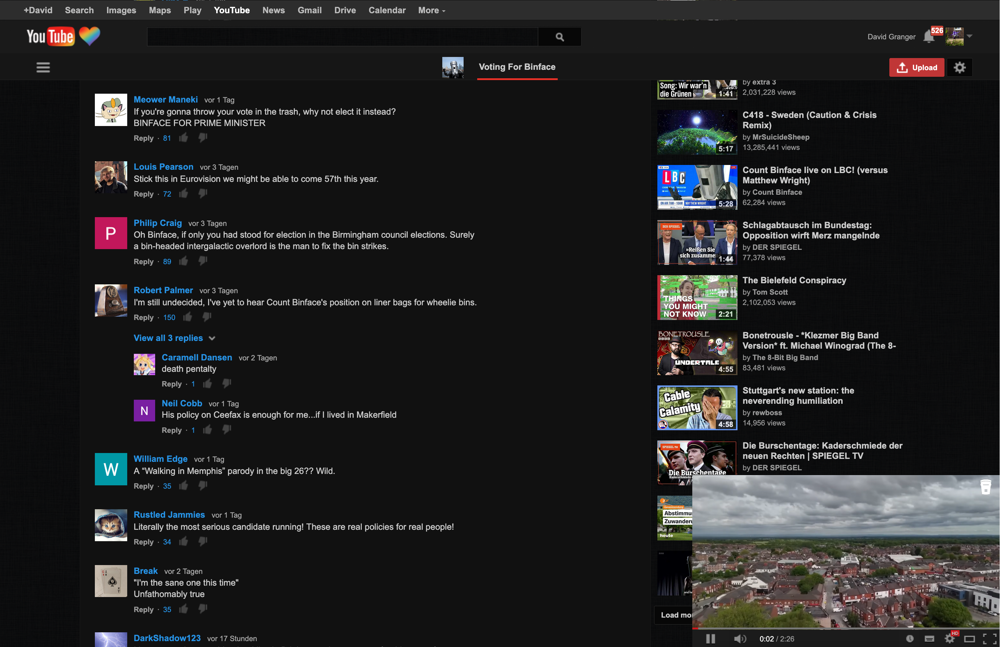

# v3-floating-player

This is a UserStyle for [V3](https://vorapis.pages.dev/#/) that makes it so that when scrolling down on the watch page, you see a small miniplayer on the bottom right. 

To install it, you need a custom CSS manager. 

You can add the CSS [using this link](https://github.com/DavidCGranger/v3-floating-player/raw/refs/heads/main/miniplayer.user.css) or via [userstyles.world](https://userstyles.world/style/28571/v3-floating-player).

